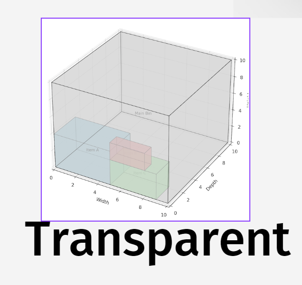

# Analysis Algorithm

## Overview
This folder contains the analysis phase documentation for the Herbalife Cubing Algorithm Project. In this phase, we focus on gathering requirements, understanding the current system, and analyzing the problem to define a better approach for packing optimization.

## Contents
- [**Analysis Artifacts**](./analysis_artifacts.md): Contains the different artifacts we want to deliver in the analysis phase.
- [**MoSCoW method priorization**](./moscow.md): Prioritization of requirements using the MoSCoW method (Must have, Should have, Could have, and Won't have).
- [**User stories**](./user_stories.md): Collection of user stories to capture the requirements from the end-users' perspective.
- [**Data flow diagrams**](./data_flow_diagrams.md): Collection of diagrams which can demonstrate the flow of certain process(es).
- TODO: Add more documents.

## Current Status
This phase aims to provide a clear foundation for design and implementation. At this point, no formal analysis has been completed, and documents will be updated as we progress.

# Analysis Visualization
This readme contains all the informatie recollected during the analysis phase, this will contain artifacts

## Project Overview

This is the table of contents of the artifacts. Below are links to specific sections:

1. [User Stories](./visualization_analysis/artifact_user_stories/README.md)
2. [Use Cases](./visualization_analysis/artifact_usecase/README.md)
3. [User flow](./visualization_analysis/artifact_user_flow/README.md)
4. [Wireframe](./visualization_analysis/artifact_wireframe/README.md)
5. [Information arquitecture](./visualization_analysis/artifact_information_arquitecture/README.md)

Each section provides detailed information about its respective area.

## Steps and Deliverables

1. **UI Development**:
   - A UI will be designed with a focus on ease of use, drawing inspiration from relevant trends and feedback from the cubing community.
   - The screen should be **responsive**, ensuring compatibility across devices of different sizes.
   - A **transparent approach** will be adopted throughout the development process, keeping all stakeholders informed and involved.(see image below)
    
   - The interface will include elements such as **boxes**, **products**, **box numbers**, and **product numbers**.
   - There will be only **one type of worker** interacting with the application which means that all the users will get the same view
   - The application will show the **packing process step-by-step**.
   - The interface will include just **three main buttons**: 
     - **Back**
     - **Next**
     - **Finish**

2. **Analysis Artifacts**:
   - The following deliverables will be created:
      - **User Personas:** Representing target users.
      - **Use Cases/User Stories:** Describing user interactions.
      - **Wireframes:** Rough layouts of the UI.
      - **User Flows:** Outlining user steps and interactions.
      - **Information Architecture (IA):** Organizing and structuring content.

3. **Feedback and Iteration**:
   - Feedback will be regularly solicited from the customer and the team throughout the draft and final product stages.
   - Weekly iterations will be conducted to ensure the project stays on track.

4. **Usability Requirements**:
   - The UI will be designed to meet a minimum **usability score**, as specified in the assignment requirements.

## Timeline and Deadline
- All development, iterations, and feedback loops will be completed by the final product deadline: **End of January 2025**.
