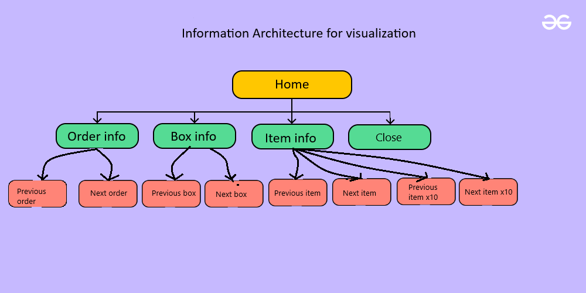

[Go back](../../analysis/)

# Information arquitecture
This part of the document will contain the information of the Information arquitecture artifact 

## Information arquitecture
In the figure below is the Information arquitecture visible

