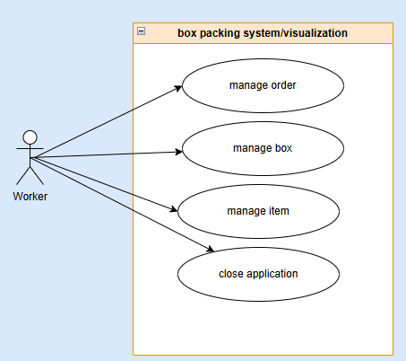

[Go back](../../analysis/)

# User case diagram
This part of the document will contain the use case diagram artifact which will show the actor and his/her functionalities

## Explanation

- Manage order: shows all order information in the visualization such as ordernumber, box(es) information, products. This also includes the previous and next order buttons
- Manage box: This shows all the box information, such as box type, current box in use(in order). This also includes the buttons previous and next box if the order has more than one box

- Manage item: this shows 4 buttons which are used to move and show the positioning of each item. the following buttons that can be managed are: previous, next, previous x10 and next x10

- Close application: this will close the order packing process

## Use case diagram
In the figure below is the use case diagram visible

