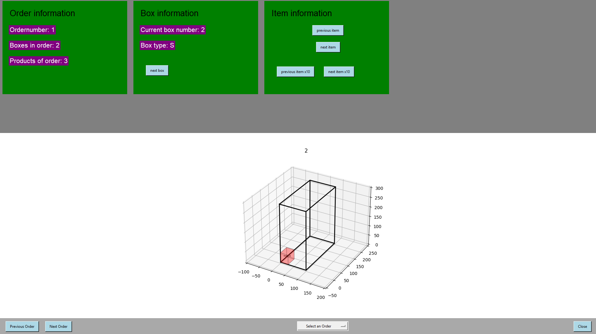

[Go back](../../analysis/)

# Wireframe
This part of the document will contain the wireframe artifact

## Explanation

- Order information: this will show the order number and how many products there are for this order

- Box information: this shows how many boxes are needed for the order, the current box that will be filled in with products and the box type the worker has to use

- 3D visualization package: this part shows the 3D representation of the box in a transparent way. When there is a black item that means that the item has to be already in the box and a red color indicates that the the next item has to be inserted in the box

- Footer: this part contains 3 buttons necessary for going to one to another order. There is also a dropdown that can be used to select an order in a faster way. The last button is responsible to close the application

## Use case diagram
In the figure below is the use case diagram

