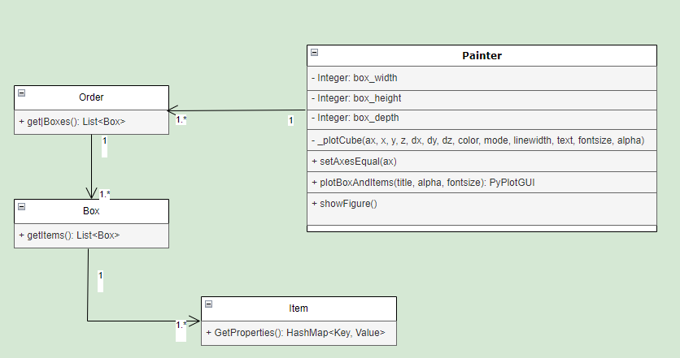

[Go back](../../design/)

# Class diagram
This part of the document will contain the class diagram artifact

## Explanation

### Explanation of Parameters in `_plotCube`

1. **`ax`**:
   - The 3D axes object (from `matplotlib`) where the cube will be drawn. It provides the plotting space and the methods to render the 3D objects. Typically created using `fig.add_subplot(111, projection='3d')`.

2. **`x`, `y`, `z`**:
   - These are the coordinates of the bottom-left-front corner (or another reference point) of the cube in 3D space. They define the starting position of the cube.
     - `x`: Position along the x-axis.
     - `y`: Position along the y-axis.
     - `z`: Position along the z-axis.

3. **`dx`, `dy`, `dz`**:
   - These are the dimensions (lengths) of the cube along the **x**, **y**, and **z** axes respectively.
     - `dx`: The size of the cube in the x-direction.
     - `dy`: The size of the cube in the y-direction.
     - `dz`: The size of the cube in the z-direction.

4. **`color`** (default: `'red'`):
   - Specifies the color of the cube. Can be any valid matplotlib color, such as `'blue'`, `'green'`, or a hex code like `'#FF5733'`.

5. **`mode`** (default: `2`):
   - Likely controls the type of cube rendering or the cube's visual style. Without the actual implementation, possible modes could include:
     - Wireframe mode (just the edges of the cube).
     - Solid mode (a fully shaded cube).
     - A combination of both or other custom styles.

6. **`linewidth`** (default: `1`):
   - Defines the thickness of the cube’s edges. A higher value means thicker lines around the edges of the cube.

7. **`text`** (default: `""`):
   - An optional text string that can be displayed near or on the cube. This could be a label or identifier for the cube in the 3D plot.

8. **`fontsize`** (default: `15`):
   - The size of the text that is displayed if the `text` parameter is provided. Controls the font size of the label associated with the cube.

9. **`alpha`** (default: `0.5`):
   - Controls the transparency of the cube. A value of `0` means completely transparent (invisible), while `1` means completely opaque. A value of `0.5` makes the cube semi-transparent.

## Information class diagram
In the figure below is the Information arquitecture visible

