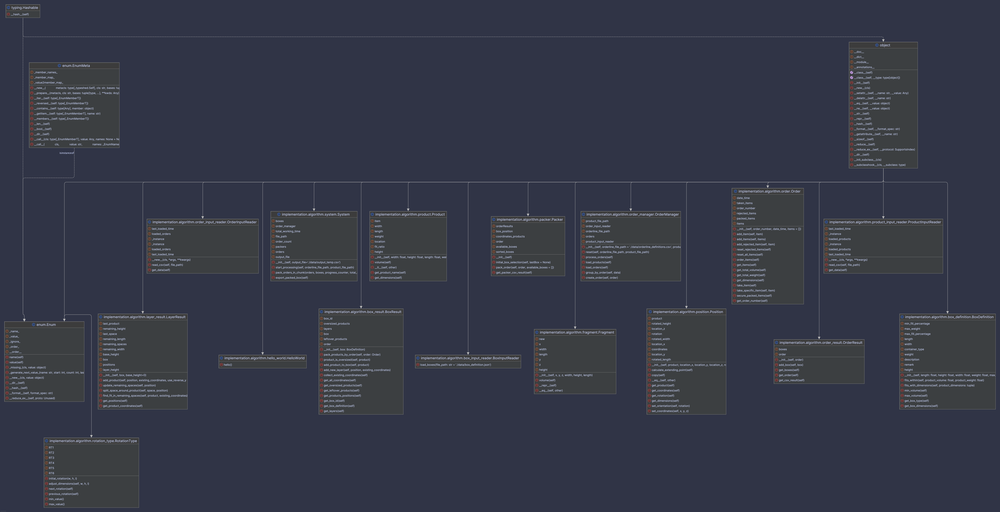

# Introduction

This section provides an overview of the algorithm implementation, including its structure and main components.

It features the **class diagram**, which visually represents the relationships between the primary classes, along with detailed definitions for each class.

# Class Diagram

# Class definitions

The class diagram illustrates the core components of our system and their interactions. Key elements include:

- **[Box Definitions](box_definition.md)**: Describes the attributes of a box, such as dimensions and weight limits.
- **[BoxInputReader](box_input_reader.md)**: Handles input data for boxes, typically from files or other external sources.
- **[BoxResult](box_result.md)**: Represents the result of packing products into a box, including packed layers, oversized products, leftover products, and associated metadata.
- **[Fragment](fragment.md)**: Represents a fragment of space that is left after placing a product in a layer.
- **[LayerResult](layer_result.md)**: represents the layers of each item and empty spaces
- **[OrderInputReader](order_input_reader.md)**: Processes input data for orders, including details about items and destinations.
- **[OrderManager](order_manager.md)**: Oversees the packing process, ensuring orders are packed efficiently and shipping costs are calculated.
- **[OrderResult](order_result.md)**: This class is used to store the results of the packing process
- **[Order](order.md)**: Represents an order, detailing the items it contains and its destination.
- **[Packer](packer.md)**: Implements the logic for packing items into boxes based on the selected algorithm.
- **[Position](position.md)**: Defines a specific location within a box, including the item's placement and orientation.
- **[ProductInputReader](product_input_reader.md)**: Reads data about products, such as their dimensions and weights, from external sources.
- **[Product](product.md)**: Represents a product to be shipped, including its physical properties.
- **[RotationType](rotation_type.md)**: Enumerates the possible ways an item can be rotated to fit within a box.
- **[System](system.md)**: Serves as the entry point for the system, initializing and executing the packing algorithm.

The diagram highlights the associations, dependencies, and implementations among these classes, offering a comprehensive understanding of the system’s design.
