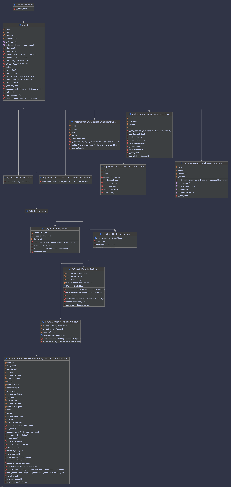

# Introduction
This part of documentation will explain the classes used for visualization

# Class Diagram

# Class definitions

The class diagram illustrates the core components of our system and their interactions. Key elements include:

- **[Box](box.md)**: Represents a container (box) that holds items and has specific dimensions.
- **[Reader](csv_reader.md)**: Handles the reading and loading of orders, boxes, and items from a CSV file.
- **[Item](item.md)**: Represents an item with a name, weight, dimensions, and position within a container.
- **[Order](order.md)**: Represents an order containing multiple boxes.
- **[Painter](painter.md)**: The Painter class visualizes a 3D box and its contained items using Matplotlib's 3D plotting features.

The diagram highlights the associations, dependencies, and implementations among these classes, offering a comprehensive understanding of the system’s design.
